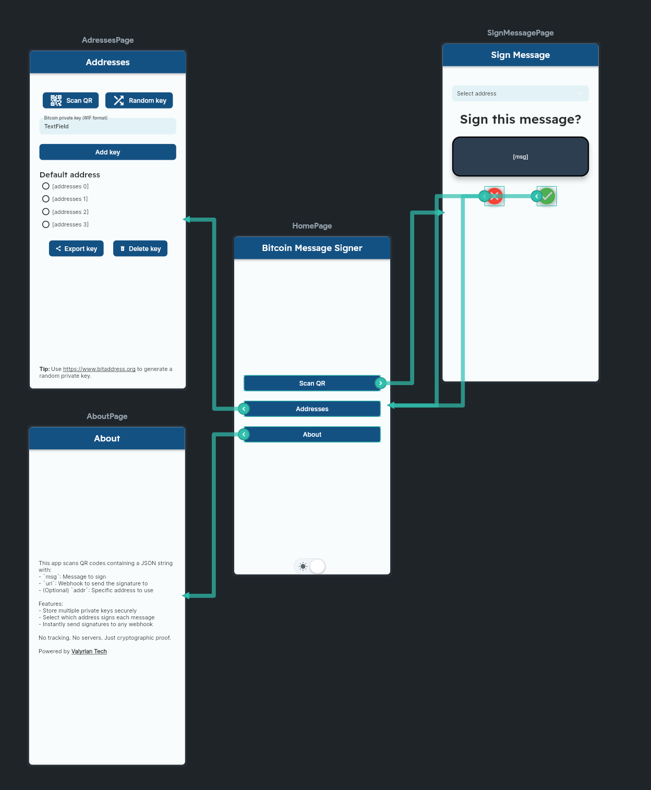

# 🐉 Bitcoin Message Signer
Bitcoin Message Signer is a secure, open-source mobile app that signs arbitrary messages using a Bitcoin private key and instantly sends the resulting cryptographic signature to any URL (webhook). 
Built with simplicity, transparency, and privacy in mind — no servers, no tracking — just pure cryptographic proof.


## 📦 Download
You can download the latest release APK here:


## 🔐 Features
📱 Scan QR codes to sign messages with a selected Bitcoin private key

🔑 Securely store multiple WIF-format Bitcoin private keys

➕ Import keys via QR, manual input, or generate random ones

✅ Select which key/address to use per message

📤 Automatically send the signature to a webhook of your choice

💡 Open-source and transparent under the MIT License

🚫 No servers. No tracking. No nonsense.


## 🧾 QR Code Format
To sign a message, the app expects a QR code (or JSON string) with the following fields:

- msg: The actual message that should be signed
- url: The webhook where the signature should be POSTed
- addr: (optional) If present, the app will sign the message using the private key tied to this address

If addr is omitted, the currently selected default key/address is used.

Example:

```json
{
  "msg": "The message to sign",
  "url": "https://example.com/webhook", 
  "addr": "1BitcoinAddress..."
}
```

## 📤 Signature Format
After signing, the app will send a POST request to the specified url with the following JSON payload:
```json
{
  "address": "1BitcoinAddress...",
  "message": "The message that was signed",
  "signature": "Base64-encoded signature string"
}
```

## 📱 Screenshots
Here’s how the app looks in light mode:



## ‍💻 Build Instructions
This app was built using FlutterFlow and can be exported and modified using the Flutter SDK.
All code is available in the 'flutterflow' branch of this repository.

## 🧪 License
MIT License. See the full [MIT License](LICENSE) for more details.

## 🚀 Brought to you by

